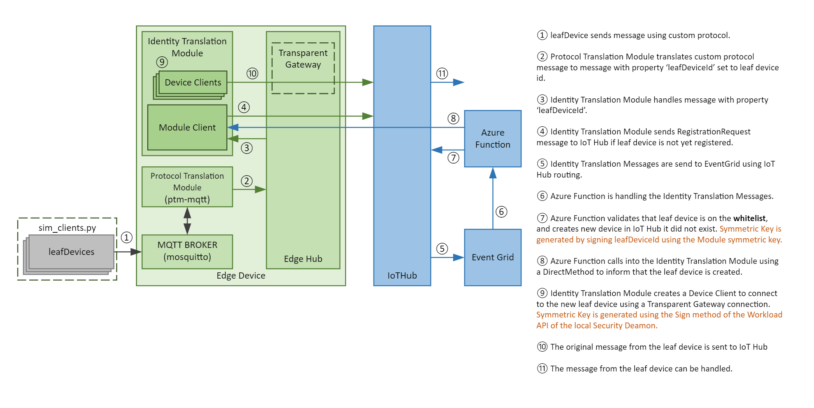
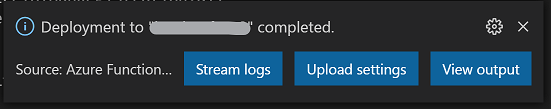
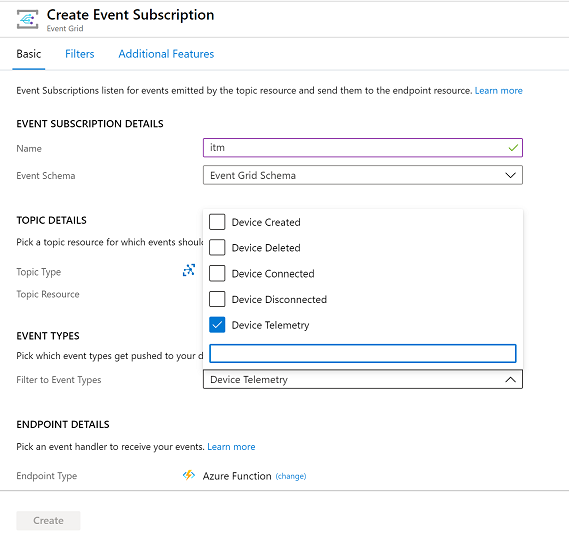
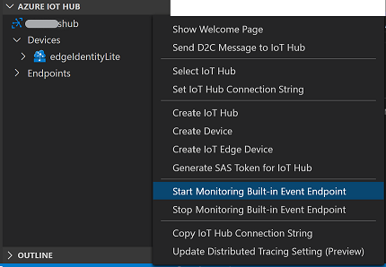

# Step-by-step manual setup of the IoT Edge Identity Translation Lite sample 

## Architecture



## Prerequisites

1. Install Visual Studio Code.
2. Install Azure IoT Tools extension in Visual Studio Code.
3. Install .NET 6.0 SDK
4. Install C# for Visual Studio Code (powered by OmniSharp) extension.
5. Make sure you have the Azure Functions tools installed in Visual Studio Code.

## Setup

### Clone repo and deploy Azure resources

1. Log into the Azure Portal and open up Cloud Shell with Bash. If you prefer you can use Azure CLI on your own machine.
2. If you have not previously installed the CLI extension for Azure IoT inside of Cloud Shell, you can install with the following commmand:
```shell
az extension add --name azure-iot
```

3. If you have installed the CLI extenion in the past, run this command to ensure you are running the latest version of the extension.
```shell
az extension update --name azure-iot
```
4. Clone this repo:
```shell
git clone https://github.com/andresu13/iot-identitytranslation-lab.git
```
5. Navigate to the deploy directory and change permissions of setup file:
```shell
cd iot-identitytranslation-lab/deploy
chmod 755 setup.sh
```
6. Execute setup.sh file to deploy Azure resources that will be used in this lab (IoT Hub, IoT Edge, Storage Account)
```shell
./setup.sh
```
7. Wait for resources to be deployed. It might take a couple of minutes.
8. Take note of the connection strings that are displayed when the script finishes.


### Create and Publish Azure Function

We will use Visual Studio Code to pre-configure and publish the Azure Function to Azure.


1. Clone this repo in your local computer (if you did not do it in the previous section)
```shell
git clone https://github.com/andresu13/iot-identitytranslation-lab.git
```
2. From this cloned repo, open the following project in Visual Studio code: **/src/cloud/functions**.
3. If you get a message asking to initialize the Azure Function with VSCode, select "Yes"


<!--- 4. Rename the `local.settings.json.temp` file into `local.settings.json`. --->
5. Open **local.settings.json** file and update the settings as follows:
```
{
    "IsEncrypted": false,
    "Values": {
        "AzureWebJobsStorage": "[storage-connectionstring]",
        "FUNCTIONS_WORKER_RUNTIME": "dotnet",
        "IoTHubConnectionString" : "[iothub-connectionstring]",
        "WhitelistStorageConnection": "[storage-connectionstring]",
        "WhitelistContainerName": "whitelist",
        "WhitelistFilename": "whitelistitm.txt"
    }
}
```
6. Publish the Function via Command Palette (View > Command Palette). Start typing Azure Function and choose 'Azure Functions: Deploy to Function App...'.
7. Make sure you choose the option 'Create new Function App in Azure - Advanced'. This option allows you to select an existing resource group and more flexibility in settings.

8. Change **Azure Functions version** to 4 and then make your selection for these options:
    - **Function name:** Enter a globally unique name
    - **Runtime Stack:** .NET 6.0
    - **OS:** Linux
    - **Resource Group:** Select the resource group created by the setup.sh script (check script output)
    - **Location:** Select the same location that was used for setup.sh script (Default: East US)
    - **Hosting plan:** Consumption
    - **Storage Account:** Select the storage account that setup.sh script created
    - **Application Insights:** Create a new Application Insights resource with a unique name you specify

9. This will take a few minutes. When finished, you will see a confirmation at the bottom right. From there you have an option to Upload Settings (configuration settings), click this to push your local.settings.json configuration.
<br />



10. You can choose "No" to the overwrite storage setting question since that was already set when the Azure function was created.


### Configure Event Grid Subscription
We'll use the Azure Portal to implement this section.

1. In Azure Portal, open your IoT Hub and choose Events.
2. Choose 'Create new subscription'.
3. Provide a name for the subscription and the topic.
4. Make sure you select only 'Device Telemetry' for the the filter to event types.



5. Under the section 'Endpoint details', leave it to Azure Function and click 'Select an endpoint'.
6. Choose the deployed Azure Function app. Under the Function dropdown you should see the LeafDeviceCloudEventGrid listed.


7. Confirm selection and then click 'Create'.
8. Back on the Events screen, you can click Event Subscriptions, it should now show the newly created subscription.
9. Next we want to filter the types of telemetry messages sent to Event Grid. We can do this using Event Grid subscription filters, but in our case we want to prevent sending all messages to the Event Grid endpoint so we will configure filtering at the IoT Hub 'Route' level.
    - Go to 'Message routing' in the IoT Hub that was created.
    - You should see a newly created route 'RouteToEventGrid'. Click on this route to open the details.
    - Change the **Routing Query** section to the following:
    ```shell
    itmtype = 'LeafEvent'
    ```
    - Click Save.

### Deploy IoT Edge modules

In this section we will use Visual Studio Code to deploy the custom Identity Translation Lite modules. For this sample we also include an MQTT broker to serve as an unsecured entry point to messages from clients. Consider this MQTT broker, as well as the MQTT translation protocol module as samples, these will typically be replaced by your own protocol that you want to bridge.

1. In Visual Studio Code, open the folder **/src/edge/** from this cloned repo.
2. Explore the modules folder to see the different Edge modules that will be deployed to the device. For this lab, the modules have already been previously built and the docker images have been uploaded to an ACR that was previosly created. You do not need to worry about building and creating docker images of these modules.
3. Select your IoT Hub via Command Palette (View > Command Palette). Start typing Azure IoT Hub and choose **Azure IoT Hub: Select IoT Hub** to select the IoT Hub that was deployed for this lab
4. Open folder **/config** from this clone repo and open the `deployment.debug.amd64.json` file.
5. Update the **username**, **password** and **address** variables with the information provided during the lab session.
5. Right-click on `deployment.debug.amd64.json` file and choose 'Create deployment for single device'.
6. In the dropdown on the command palette, select your Edge device **edgeIdentityLite**.
7. You should get an output saying "Deployment succeeded"
8. Validate the modules got deployed and are running, either through the Azure Portal, or by SSH into your VM.
    - Via Cloud Shell run the ssh command to log into the machine:
    ```shell
    ssh azureuser@[yourvmipaddress]
    ```
    - **Password**: Passw0rd1234!
    - Run the command `iotedge list` to view the running modules.
    - You should see five modules running. Note it can take 30 seconds to a few minutes to get all the containers running.


### Connect to Edge VM and download testing script to simulate clients
Note: we use the same VM as the one running IoT Edge for ease of use. You could also run the client MQTT client scripts on another machine but then you would need to configure networking to allow incoming traffic on the VM.

1. SSH into the Edge VM, if you are not yet logged in. You can use Cloud Shell for this.
- **User:** azureuser
- **Password:** Passw0rd1234!

2. Download the python script that will be used to test the identity translation solution:
```shell
wget https://raw.githubusercontent.com/andresu13/iot-identitytranslation-lab/main/src/test/sim_clients.py
```


## Run the sample and simulate clients

1. Using Visual Studio Code, with the Azure IoT Tools, start listening to telemetry messages from the IoT Edge device: right-click the Azure IoT Hub pane and choose **Start Monitoring Built-in Event Endpoint**.<br>
2. Back in the Cloud Shell, SSH into the VM.
3. Run the simulator script:
```shell
python3 sim_clients.py -c 6 -n client -i 1
```
4. Leave it running for now, you can now go into Visual Studio Code and should see message logging for th creation of the devices such as this:
```
[IoTHubMonitor] [3:23:34 PM] Message received from [edgeIdentityLite/IdentityTranslationLite]:
{
  "body": {
    "hubHostname": "[iothub-name].azure-devices.net",
    "leafDeviceId": "client2",
    "edgeDeviceId": "edgeIdentityLite",
    "edgeModuleId": "IdentityTranslationLite",
    "operation": "create"
  },
  "applicationProperties": {
    "itmtype": "LeafEvent"
  }
}
```
5. After a few moments, the Azure Function will have executed, and the Identity Translation module will start being able to send messages with the leaf device identities.

6. In Visual Studio Code, you can click the referesh button in the Azure IoT Hub pane to see the new device identities that were created.

7. Click on **Stop Monitoring Built-in Event Endpoint** button located in at the bottom of Visual Studio Code.

7. Right click on "client1" device and choose **Start Monitoring Built-in Event Endpoint** to start seeing the translated messages coming with the identity of client1.

```
[IoTHubMonitor] [4:06:47 PM] Message received from [client1]:
{
  "topic": "device/client1/message",
  "payload": {
    "param2": 0.7107092914863314,
    "param1": 39
  }
}
```

6. You might also want to check the logs for the Event Grid subscription and the Azure Function logs to see how it executed.
7. To close down the script you can exit the sim_clients.py script running.


### Clean up resources

To remove everything you created you can simply delete the Resource Group in Azure, both the VM and all Azure services will be deleted.


### Credits

This lab is based on the work done by the collaborators of this repo: https://github.com/Azure-Samples/azure-iot-edge-identity-translation-lite

Some steps have been automated to simplify the delivery of this lab in a shorter amount of time.

