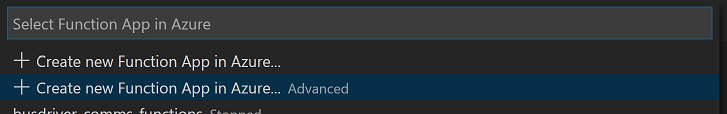
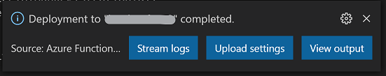
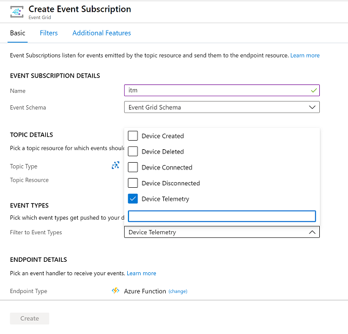
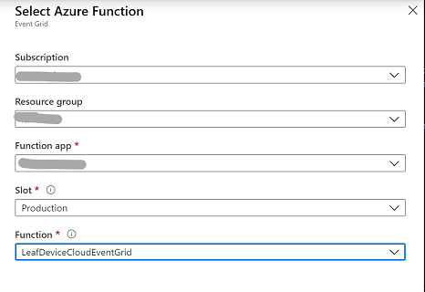
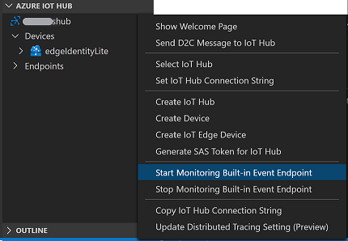

This lab is based on:

https://github.com/Azure-Samples/azure-iot-edge-identity-translation-lite


# Step-by-step manual setup of the IoT Edge Identity Translation Lite sample 

## Prerequisites

1. Install Visual Studio Code.
2. Install Azure IoT Tools extension in Visual Studio Code.
3. Install .NET 6.0 SDK
4. Install C# for Visual Studio Code (powered by OmniSharp) extension.
5. Make sure you have the Azure Functions tools installed in Visual Studio Code.
6. Make sure you have Docker Desktop on your machine, we will need it for building and pushing the images.

## Setup

### Clone repo and deploy Azure resources

1. Log into the Azure Portal and open up Cloud Shell with Bash. If you prefer you can use Azure CLI on your own machine.
2. Make sure you have installed CLI extension for Azure IoT: 
`az extension add --name azure-iot`
3. Clone this repo:
`git clone https://github.com/andresu13/iot-identitytranslation-lab.git`
4. Navigate to the deploy directory and change permissions of setup file:
```shell
cd iot-identitytranslation-lab/deploy
chmod 755 setup.sh
```
5. Execute setup.sh file to deploy Azure resources that will be used in this lab (IoT Hub, IoT Edge, Storage Account)
`./setup.sh`
6. Wait for resources to be deployed. It might take a couple of minutes.
7. Take note of the connection strings the script outputs at the end.


### Create and Publish Azure Function

We will use Visual Studio Code to pre-configure the Azure Function to run locally in a subsequent step, as well as use VS Code to help us create and publish the Azure Function to Azure.


1. Clone this repo in your local computer (if you did not do it in the previous step)
2. From this cloned repo, open the following project in Visual Studio code: /src/cloud/functions.
3. If you get a message asking to initialize Azure Function with VSCode, say "Yes"
3. Rename the `local.settings.json.temp` file into `local.settings.json`.
4. Update the settings as follows:
```
{
    "IsEncrypted": false,
    "Values": {
        "AzureWebJobsStorage": "[storage-connectionstring]",
        "FUNCTIONS_WORKER_RUNTIME": "dotnet",
        "IoTHubConnectionString" : "[iothub-connectionstring]",
        "WhitelistStorageConnection": "[storage-connectionstring]",
        "WhitelistContainerName": "whitelist",
        "WhitelistFilename": "whitelistitm.txt"
    }
}
```
6. Publish the Function via Command Palette (View > Command Palette). Start typing Azure Function and choose 'Azure Functions: Deploy to Function App...'.
7. Make sure you choose the option 'Create new Function App in Azure - Advanced'. This option allows you to select an existing resource group and more flexibility in settings.<br>
8. Change **Azure Functions version** to 4 and then make your selection for these options:
    - Provide a function name: [function-name]
    - Runtime: .NET 6.0
    - OS: Linux
    - Hosting plan: Consumption
    - Select resource group: make sure you select the resource group created in the first part of this guide.
    - Create or choose an existing storage account.
    - Create a new Application Insights instance.
    - Select the same location [region] as where you deployed your resource group.
9. This will take a few minutes. When finished, you will see a confirmation at the bottom right. From there you have an option to Upload Settings (configuration settings), click this to push your local.settings.json configuration.<br><br>Typically you can choose not to overwrite the Storage setting as this one has been set when creating the Azure function.


### Configure Event Grid Subscription
We'll use the Azure Portal to implement this section.

1. In Azure Portal, open your IoT Hub and choose Events.
2. Choose 'Create new subscription'.
3. Provide a name and make sure you select only 'Device Telemetry' for the the filter to event types.<br>
4. Under the section 'Endpoint details', leave it to Azure Function and click 'Select an endpoint'.
5. Choose the deployed Azure Function app. Under the Function dropdown you should see the LeafDeviceCloudEventGrid listed.<br>
6. Confirm selection and then click 'Create'.
7. Back on the Events screen, you can click Event Subscriptions, it should now show the newly created subscription.
8. Next we want to filter the types of telemetry messages sent to Event Grid. We can do this using Event Grid subscription filters, but in our case we want to prevent sending all messages to the Event Grid endpoint so we will configure filtering at the IoT Hub 'Route' level.
    - Go to 'Message routing'. You should see a newly created route 'RouteToEventGrid'. Click on this route to open the details.
    - Change the Query section to the following: `itmtype = 'LeafEvent'`.
    - Click Save.

### Deploy IoT Edge modules

In this section we will use Visual Studio Code to configure, build and deploy the custom Identity Translation Lite modules. For this sample we also include an MQTT broker to serve as an unsecured entry point to messages from clients. Consider this MQTT broker, as well as the MQTT translation protocol module as samples, these will typically be replaced by your own protocol that you want to bridge.

1. In Visual Studio Code, open the folder /src/edge/ from this cloned repo.
2. Configure the local environment settings:
    - Create a new .env file (or rename the supplied `.env.temp` one)
    - Copy the variables from `.env.temp` and fill in the Azure Container registry username, password and login server with the values you retrieved above.
3. Login into the server with docker, open the Terminal in Visual Studio Code: `docker login [acr-name].azurecr.io -p "[acr-password]" -u [acr-username]`
4. Review the deployment template `deployment.debug.template.json`. This one contains three custom modules:
    - Identity Translation Module (`itm`): this is the core of the solution taking care of doing identity translation, sending a creation message to the cloud (for provisioning and child device assignment), and some caching of messages while the device is under creation.
    - Protocol Translation Module `ptm`: this is a sample that reads messages from an MQTT Mosquitto broker installed on the Edge as an additional module. It puts messages into edgeHub for further processing by the Identity Translation module.
    - Mosquitto: this is a standard Eclipse Mosquitto MQTT broker, which unsecure clients (our Python code) will connect to.
5. In Visual Studio, make sure you configure the Azure IoT Hub extension to be connected to your newly created hub. Open Command Palette, type `Azure IoT Hub: Select IoT Hub`. Select your hub to persist.
6. Right-click the `deployment.debug.template.json` file and choose 'Build and Push IoT Edge Solution'. This step builds the container images `itm` and `ptm` and pushes them to your configured Azure container registry.
7. Now we can deploy to our IoT edge VM, there is now a configuration file under `/.confg/deployment.debug.amd64.json`. Right-click this file and choose 'Create deployment for single device'.
8. In the dropdown on the command palette, select your edge device 'edgeIdentityLite'.
9. Validate the modules got deployed and are running, either through the Azure Portal, or by SSH into your VM.
    - Via Cloud Shell run the ssh command to log into the machine `ssh azureuser@[yourvmipaddress]`
    - Password is 'Passw0rd1234!'
    - Run the command `iotedge list` to view the running modules. You should see five modules running. Note it can take 30 seconds to a few minutes to get all the containers running.


### Install Python and simulation script on VM
Note: we use the same VM as the one running IoT Edge for ease of use. You could also run the client MQTT client scripts on another machine but then you would need to configure networking to allow incoming traffic on the VM.

1. SSH into the Edge VM, if you are not yet logged in. You can use Cloud Shell for this.
2. Install Python 3 on the VM:
    ```
    sudo apt-get update
    sudo apt-get install -y python3-dev
    sudo apt-get install -y libffi-dev
    sudo apt-get install -y libssl-dev
    sudo apt install python3-pip
    sudo pip3 install paho-mqtt
    ```
3. Copy the file with the simulation of devices to the VM. This file can be found on /src/test/sim_clients.py
    - If using Cloud Shell, first upload the file to the cloud shell storage/disk by using the Upload/download files option.
4. Exit the SSH session and copy the file from local Cloud shell disk to your VM:
    `scp sim_clients.py [youruser]@[yourVMIP]:/home/[your_user]/sim_clients.py `
5. SSH back into the VM and validate the file is ready to be used: `ls` should return 'sim_clients.py'.

## Run the sample and simulate clients

1. Using Visual Studio Code, with the Azure IoT Tools, start listening to telemetry messages from the IoT Edge device: right-click the Azure IoT Hub pane and choose 'Start Monitoring Built-in Event Endpoint'.<br>
2. Back in the Cloud Shell, SSH into the VM.
3. Run the simulator script: 
`python3 sim_clients.py -c 6 -n client -i 1`
4. Leave it running for now, you can now go into Visual Studio Code and should see message logging for th creation of the devices such as this:
```
[IoTHubMonitor] [3:23:34 PM] Message received from [edgeIdentityLite/IdentityTranslationLite]:
{
  "body": {
    "hubHostname": "[iothub-name].azure-devices.net",
    "leafDeviceId": "client2",
    "edgeDeviceId": "edgeIdentityLite",
    "edgeModuleId": "IdentityTranslationLite",
    "operation": "create"
  },
  "applicationProperties": {
    "itmtype": "LeafEvent"
  }
}
```
5. After a few moments, the Azure Function will have executed, and the Identity Translation module will start being able to send messages with the leaf device identities, such as:
```
[IoTHubMonitor] [4:06:47 PM] Message received from [client1]:
{
  "topic": "device/client1/message",
  "payload": {
    "param2": 0.7107092914863314,
    "param1": 39
  }
}
```
6. You might also want to check the logs for the Event Grid subscription and the Azure Function logs to see how it executed.
7. To close down the script you can exit the sim_clients.py script running.


### New steps (Added by Andres)

1. Download sim_clients.py by running the following command:
wget https://github.com/andresu13/iot-identitytranslation-lab/blob/main/test/sim_clients.py

### Clean up resources

To remove everything you created you can simply delete the Resource Group in Azure, both the VM and all Azure services will be deleted.


